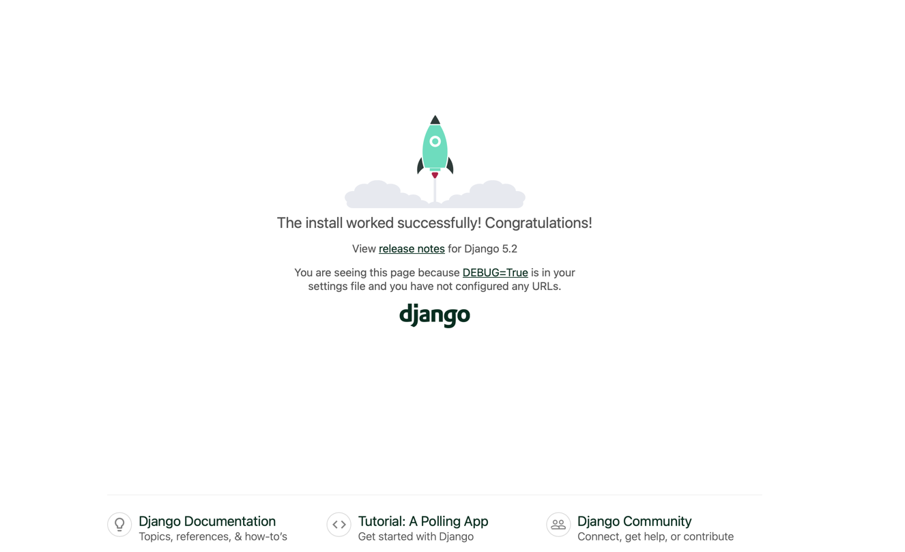
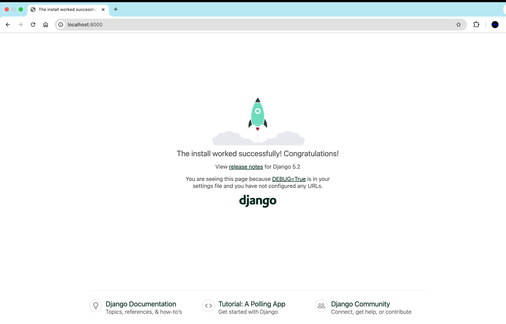
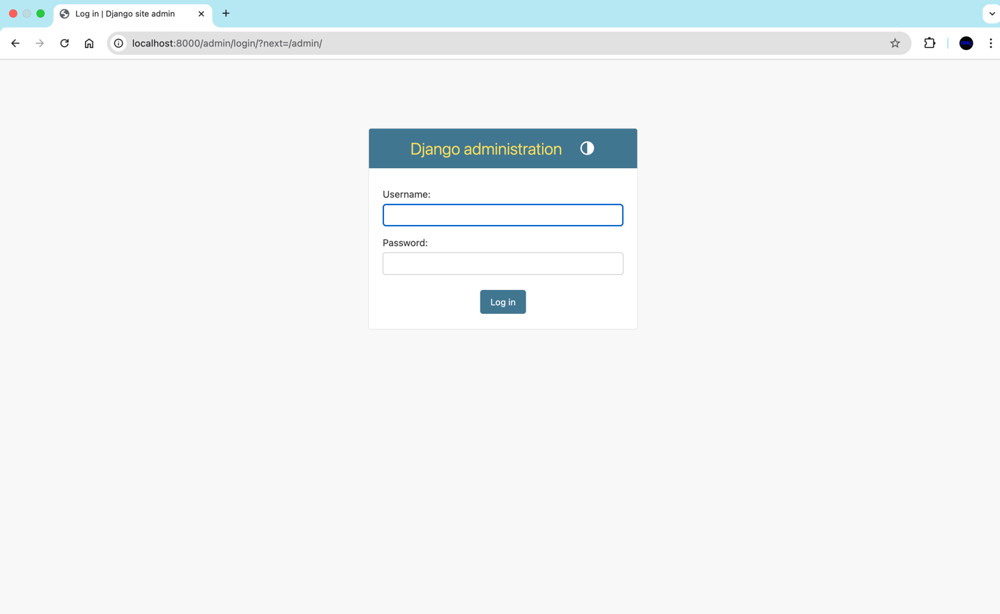
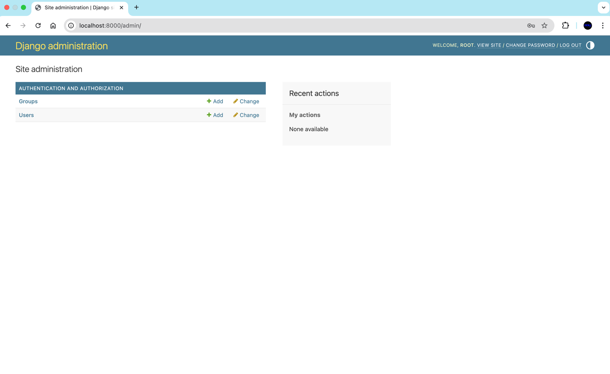
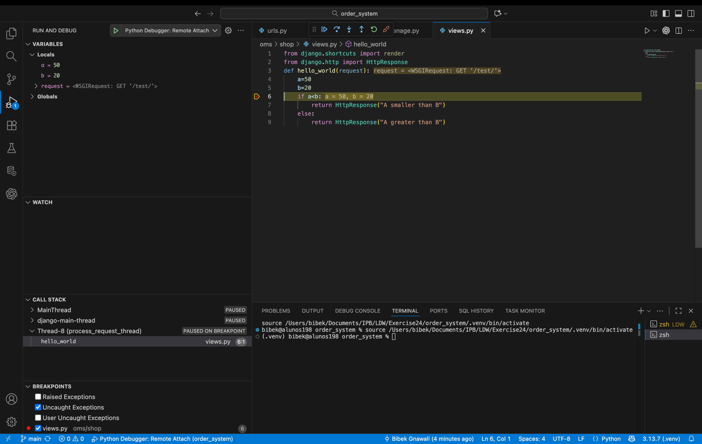
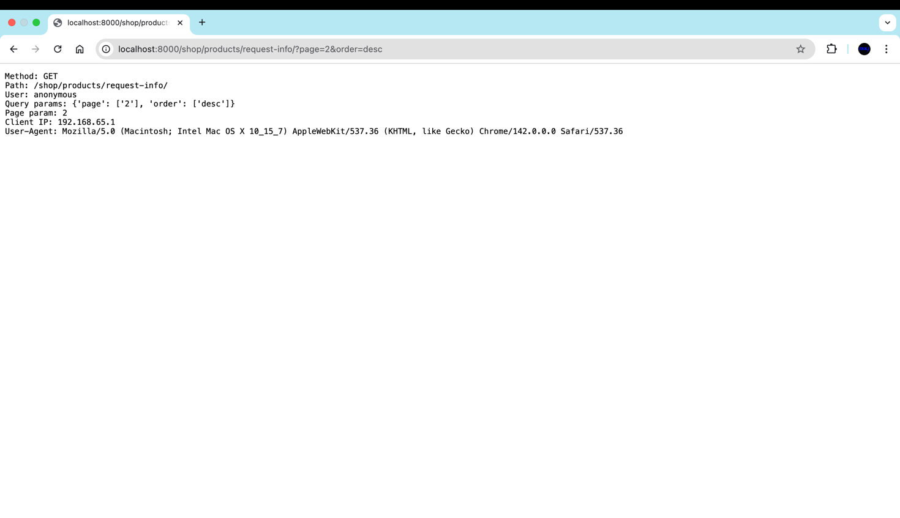
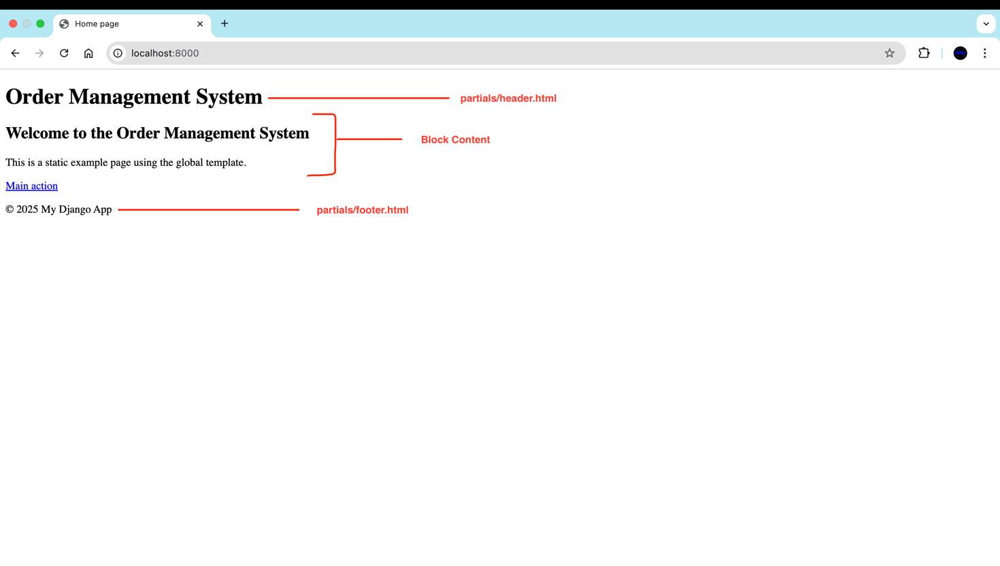
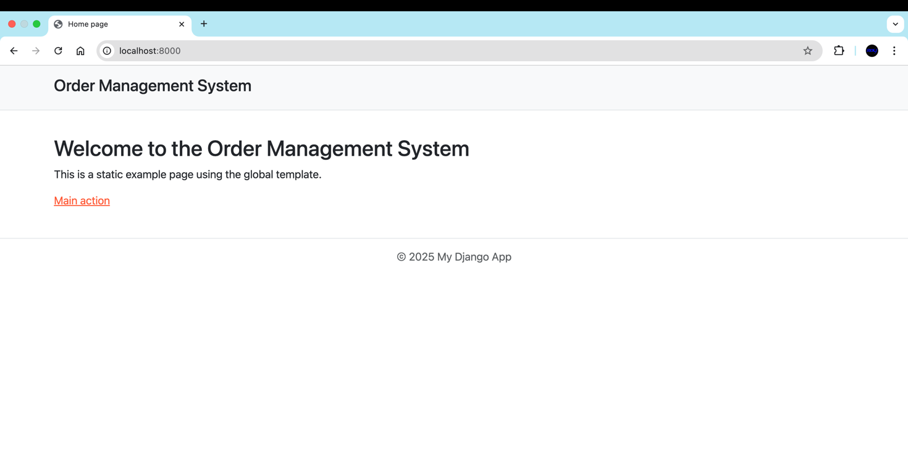
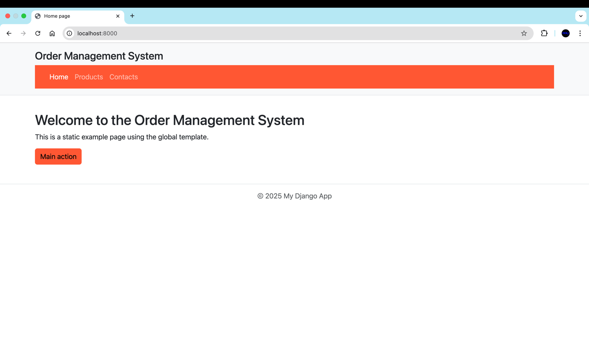
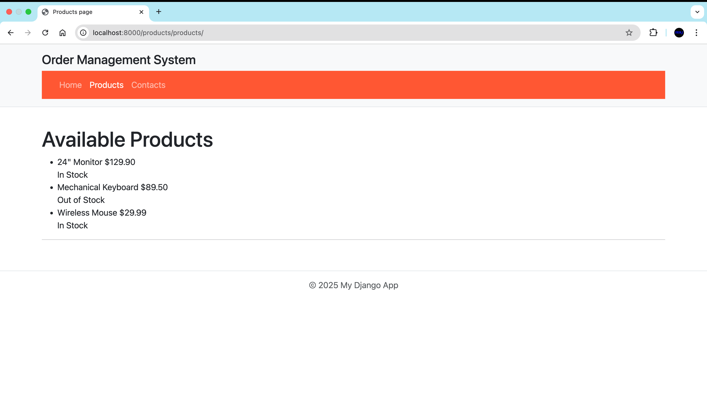

# Exercise 24

# Exercise 25
### OMS DB Logs

2025-10-22 17:43:32.123 | 
2025-10-22 17:43:32.124 | PostgreSQL Database directory appears to contain a database; Skipping initialization
2025-10-22 17:43:32.124 | 
2025-10-22 17:43:32.144 | 2025-10-22 16:43:32.144 UTC [1] LOG:  starting PostgreSQL 16.10 (Debian 16.10-1.pgdg13+1) on aarch64-unknown-linux-gnu, compiled by gcc (Debian 14.2.0-19) 14.2.0, 64-bit
2025-10-22 17:43:32.144 | 2025-10-22 16:43:32.144 UTC [1] LOG:  listening on IPv4 address "0.0.0.0", port 5432
2025-10-22 17:43:32.144 | 2025-10-22 16:43:32.144 UTC [1] LOG:  listening on IPv6 address "::", port 5432
2025-10-22 17:43:32.145 | 2025-10-22 16:43:32.145 UTC [1] LOG:  listening on Unix socket "/var/run/postgresql/.s.PGSQL.5432"
2025-10-22 17:43:32.146 | 2025-10-22 16:43:32.146 UTC [28] LOG:  database system was shut down at 2025-10-22 16:43:02 UTC
2025-10-22 17:43:32.148 | 2025-10-22 16:43:32.148 UTC [1] LOG:  database system is ready to accept connections

### OMS Web Logs

2025-10-22 17:43:32.599 | Operations to perform:
2025-10-22 17:43:32.599 |   Apply all migrations: admin, auth, contenttypes, sessions
2025-10-22 17:43:32.599 | Running migrations:
2025-10-22 17:43:32.606 |   Applying contenttypes.0001_initial... OK
2025-10-22 17:43:32.626 |   Applying auth.0001_initial... OK
2025-10-22 17:43:32.632 |   Applying admin.0001_initial... OK
2025-10-22 17:43:32.635 |   Applying admin.0002_logentry_remove_auto_add... OK
2025-10-22 17:43:32.637 |   Applying admin.0003_logentry_add_action_flag_choices... OK
2025-10-22 17:43:32.642 |   Applying contenttypes.0002_remove_content_type_name... OK
2025-10-22 17:43:32.643 |   Applying auth.0002_alter_permission_name_max_length... OK
2025-10-22 17:43:32.649 |   Applying auth.0003_alter_user_email_max_length... OK
2025-10-22 17:43:32.651 |   Applying auth.0004_alter_user_username_opts... OK
2025-10-22 17:43:32.653 |   Applying auth.0005_alter_user_last_login_null... OK
2025-10-22 17:43:32.653 |   Applying auth.0006_require_contenttypes_0002... OK
2025-10-22 17:43:32.655 |   Applying auth.0007_alter_validators_add_error_messages... OK
2025-10-22 17:43:32.658 |   Applying auth.0008_alter_user_username_max_length... OK
2025-10-22 17:43:32.661 |   Applying auth.0009_alter_user_last_name_max_length... OK
2025-10-22 17:43:32.663 |   Applying auth.0010_alter_group_name_max_length... OK
2025-10-22 17:43:32.665 |   Applying auth.0011_update_proxy_permissions... OK
2025-10-22 17:43:32.667 |   Applying auth.0012_alter_user_first_name_max_length... OK
2025-10-22 17:43:32.670 |   Applying sessions.0001_initial... OK
2025-10-22 17:43:33.104 | 
2025-10-22 17:43:33.104 | 0 static files copied to '/home/app/web/staticfiles', 127 unmodified.
2025-10-22 17:43:33.920 | Performing system checks...
2025-10-22 17:43:33.920 | 
2025-10-22 17:43:33.920 | Watching for file changes with StatReloader
2025-10-22 17:43:33.929 | System check identified no issues (0 silenced).
2025-10-22 17:43:33.948 | October 22, 2025 - 16:43:33
2025-10-22 17:43:33.948 | Django version 5.2.7, using settings 'oms.settings'
2025-10-22 17:43:33.948 | Starting development server at http://0.0.0.0:8000/
2025-10-22 17:43:33.948 | Quit the server with CONTROL-C.
2025-10-22 17:43:33.948 | 
2025-10-22 17:43:33.948 | WARNING: This is a development server. Do not use it in a production setting. Use a production WSGI or ASGI server instead.
2025-10-22 17:43:33.948 | For more information on production servers see: https://docs.djangoproject.com/en/5.2/howto/deployment/
2025-10-22 17:43:44.890 | [22/Oct/2025 16:43:44] "GET / HTTP/1.1" 200 12068
2025-10-22 17:43:45.102 | Not Found: /favicon.ico
2025-10-22 17:43:45.102 | Not Found: /apple-touch-icon-precomposed.png
2025-10-22 17:43:45.103 | [22/Oct/2025 16:43:45] "GET /favicon.ico HTTP/1.1" 404 2205
2025-10-22 17:43:45.103 | [22/Oct/2025 16:43:45] "GET /apple-touch-icon-precomposed.png HTTP/1.1" 404 2268
2025-10-22 17:43:45.184 | Not Found: /apple-touch-icon.png
2025-10-22 17:43:45.184 | [22/Oct/2025 16:43:45] "GET /apple-touch-icon.png HTTP/1.1" 404 2232
### Screenshots

# Exercise 26
## Django Admin

## Exercise 26c
 List of relations  
 Schema |            Name            | Type  | Owner   
--------+----------------------------+-------+-------  
 public | auth_group                 | table | oms  
 public | auth_group_permissions     | table | oms  
 public | auth_permission            | table | oms  
 public | auth_user                  | table | oms  
 public | auth_user_groups           | table | oms  
 public | auth_user_user_permissions | table | oms  
 public | django_admin_log           | table | oms  
 public | django_content_type        | table | oms  
 public | django_migrations          | table | oms  
 public | django_session             | table | oms  
(10 rows)

## staticfiles directory structure
### /staticfiles/admin/css:  
autocomplete.css  
dark_mode.css  
login.css  
responsive_rtl.css  
vendor  
base.css  
dashboard.css  
nav_sidebar.css  
rtl.css  
widgets.css  
changelists.css  
forms.css  
responsive.css  
unusable_password_field.css  

### /staticfiles/admin/img  
LICENSE  
icon-addlink.svg  
icon-clock.svg  
icon-unknown-alt.svg  
inline-delete.svg  
tooltag-add.svg  
README.txt  
icon-alert.svg  
icon-deletelink.svg  
icon-unknown.svg  
search.svg  
tooltag-arrowright.svg  
calendar-icons.svg  
icon-calendar.svg  
icon-hidelink.svg  
icon-viewlink.svg  
selector-icons.svg  
gis   
icon-changelink.svg  
icon-no.svg  
icon-yes.svg  
sorting-icons.svg 

### /staticfiles/admin/js  
SelectBox.js  
autocomplete.js  
core.js  
nav_sidebar.js  
theme.js  
SelectFilter2.js  
calendar.js  
filters.js  
popup_response.js  
unusable_password_field.js  
actions.js  
cancel.js  
inlines.js  
prepopulate.js  
urlify.js  
admin  
change_form.js  
jquery.init.js  
prepopulate_init.js  
vendor  

# Exercise 27

# Exercise 28

# Exercise 29

# Exercise 31

# Exercise 32
